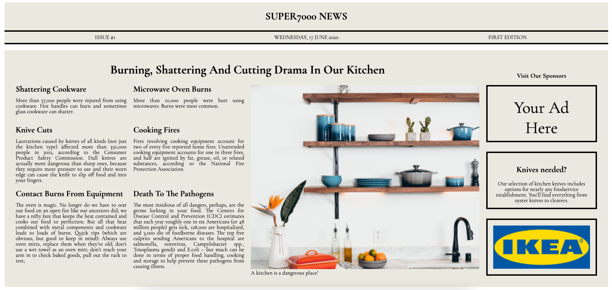

# Project Newspaper

Welcome to the Project Newspaper! This project presents a newspaper-styled webpage that highlights various kitchen-related safety articles.

The learning goal was to use CSS Grid.

## Table of Contents

- [Demo](#demo)
- [Screenshot](#screenshot)
- [Features](#features)
- [Technologies Used](#technologies-used)
- [Getting Started](#getting-started)
- [Usage](#usage)
- [License](#license)
- [Acknowledgements](#acknowledgements)

## Demo

You can view the project by visiting the [live demo](https://shakedown3000.github.io/project_newspaper/).

## Screenshot

## Features

- Header with issue details including date and edition.
- Main content featuring various kitchen safety articles.
- Sponsors section with advertisements.
- Grid layout for responsive design.
- Custom fonts for a newspaper-like feel.

## Technologies Used

- HTML
- CSS
- Google Fonts

## Getting Started

To get a local copy up and running, follow these steps:

### Prerequisites

Make sure you have a web browser installed.

### Installation

1. Clone the repository:
   git clone https://github.com/shakedown3000/project_newspaper.git

2. Navigate to the project directory:

   cd project_newspaper

### Running the Project

Simply open the `index.html` file in your web browser:

open index.html
